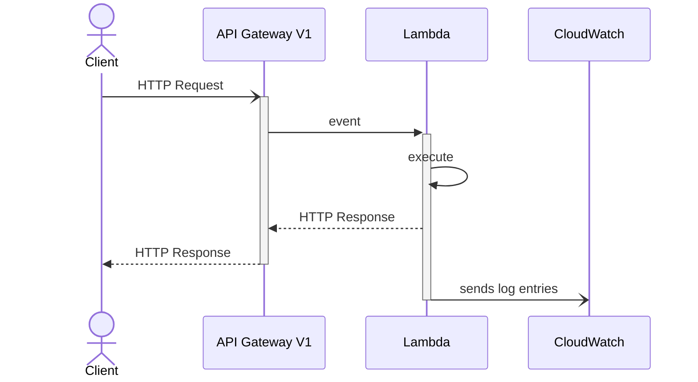

# Hello API

쿼리스트링 파라미터를 받아서 `Hello 이름`을 반환하는 간단한 API를 만든다. API Gateway Lambda Proxy 통합을 사용한다. Lambda 함수는 요청 데이터를 분석하여 정상 응답을 하거나 오류를 응답한다.

## Sequence Diagrams

## Notes

- 기본적으로 API Gateway는 초당 10,000건의 요청을 처리할 수 있다.
- Lambda Proxy 통합 시 수행 시간이 29초를 넘어가면 타임아웃이 발생한다.
- Lambda에서 사용하는 코드는 압축된 경우 최대 50MB, 압축 해제된 경우 최대 250MB까지 허용한다.
- Lambda 함수는 수행 시간이 900초를 넘어가면 타임아웃이 발생한다.

더 자세한 내용은 문서하단을 링크를 확인한다.

## References

- [API Gateway Lambda proxy integration](https://docs.aws.amazon.com/ko_kr/apigateway/latest/developerguide/set-up-lambda-proxy-integrations.html)
- [API Gateway quotas for configuring and running a REST API](https://docs.aws.amazon.com/apigateway/latest/developerguide/limits.html#api-gateway-execution-service-limits-table)
- [Comparing Lambda invocation modes](https://docs.aws.amazon.com/lambda/latest/operatorguide/invocation-modes.html)
